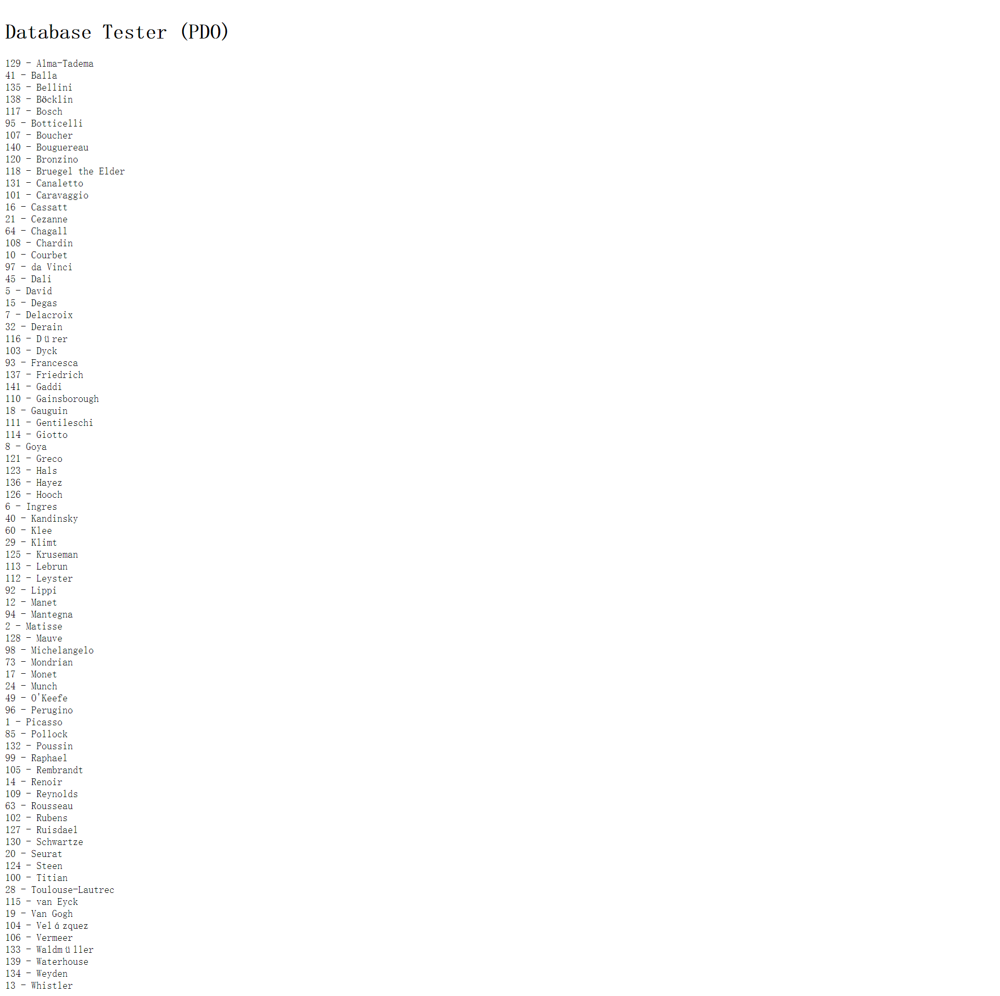

## **exercise7**

PDO扩展为PHP访问数据库定义了一个轻量级的一致接口；PDO 提供了一个数据访问抽象层，这意味着，不管使用哪种数据库，都可以用相同的函数来查询和获取数据。

从上至下代码的逻辑分别是：建立数据库连接，设置查询语句，执行查询语句，遍历查询结果并输出，终止连接。

而MySQLi只允许访问 MySQL 数据库服务器，对其他类型的数据库无效。

代码逻辑与上述几乎相同：建立数据库连接，设置查询语句，执行查询语句，遍历查询结果并输出，终止连接。

但此例子在遍历查询结果时，将其放入下拉选单（<option>)，前一例子则是直接输出。

## **exercise8**

outputArtists()中，遍历结果时将其输出为<a>标签，以达到点击显示详情的功能，再通过判断语句切换class值以改变样式。

outputPaintings()建立与数据库的连接，在遍历查询结果时调用outputSinglePainting($row)方法

outputSinglePainting($row)则建立文件结构，image和content分别显示当前图片的信息，而item则留给下一张图片，以此类推形成展示的结构。

三个方法是要点在于，判断用户点击的是哪个艺术家，通过在a标签的href里的id，点击后通过$_GET数组便可获得id值，以此进行操作。

## **exercise9**

1、使用PDO中的exec()方法，该方法返回值为int类型，为执行sql语句后受影响的行数

2、使用PDO中的query()方法，用于返回执行查询后的结果集

3、使用PDO中的预处理语句prepare()和execute()执行SQL查询语句

​	预处理语句的好处：

查询仅需解析一次，可以避免重复分析、编译并优化周期。预处理语句占用的资源更少，运行更快。

4、使用MySQLi的mysqli_query()方法，返回执行查询后的结果集。

## **exercise10**

表中不存在红圈圈出的这一列，我将其改成GenreID运行后结果如上图。

其关键要素仍是id值，根据id值匹配页面内容。