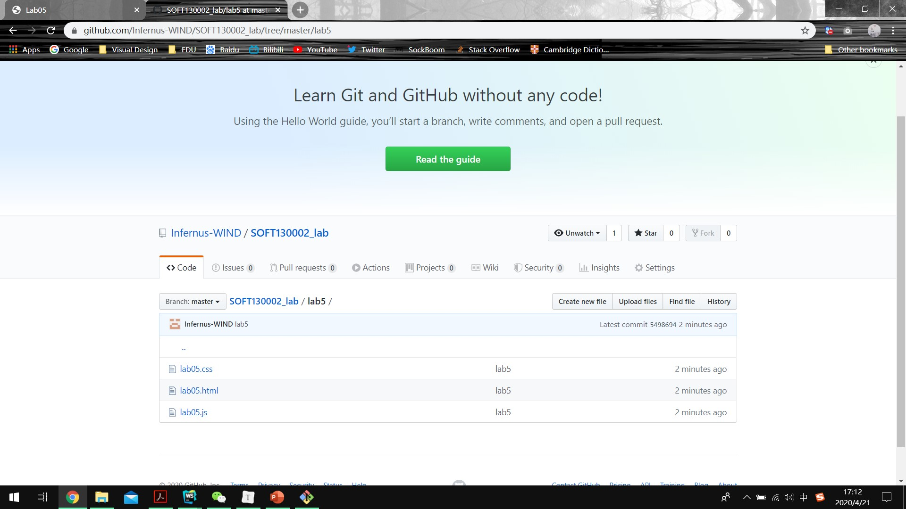
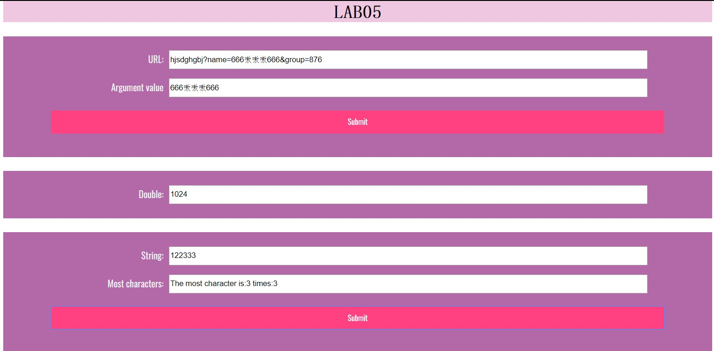

**第一部分：**

主要运用字符串的split()函数，先将url从“？”处分隔，取后半部分后，再将其从“&”分隔，便可得url中的名值对，而后通过遍历每个名值对，再将名值对从“=”分隔成名和值，若名是“name”，则输出改值。

**第二部分：**

主要运用setInterval() 方法，可按照指定的周期来调用函数或计算表达式。

用Date对象的getSeconds()方法，来判断当前是否为00秒。

通过简单的逻辑，判断是否满足停止的要求。

**第三部分：**

主要通过对象中名值对的方式进行统计判断

首先要遍历字符串中的每个字符，若该字符第一次出现，则给对象加上以该字符为名的属性，值为1；若之前出现过，则将值+1.遍历完成后，通过比大小来确定出现次数最多的字符，在我写的逻辑下，若出现次数相同，则取更早出现的那个字符为最终结果。

