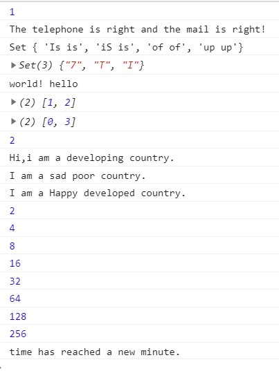

**正则表达式部分**

2、对于电话号码，是1开头的11位数字，则先匹配一个1，再匹配10个数字。

对于邮箱地址，应当是xxx@xxx.xxx的形式，但域名可有多个，比如163.com和fudan.edu.cn的区别。

所以先匹配可包含字母数字.和_的字符串，而后匹配@符号

而后邮件服务器名称可由字母数字构成，而后域名则由.“str”构成，其中顶级域名是2-6个字符的纯字母字符串

3、用 \b匹配一个单词的边界，然后用([a-z]+)表示一个单词，随后用\1匹配前一个匹配过的单词，\b表示边界，i表示不区分大小写，g表示全局匹配

**继承部分**

1、借用构造函数

​	在子类构造函数中调用父类的构造函数，在用子类构造函数创建子类实例时，子类实例便会获得父类的属性，以实现继承。但是父类原型中的属性和方法对子类是不可见的，且父类的实例方法也无法被子类使用。

2、原型链继承

​	本质是将子类的原型设置为父类的实例。而这样的话，父类的实例属性便会成为子类的原型属性

3、原型式继承

​	基于原有对象创建新对象，本质是做了已有对象的浅复制。

**Map、Set、Array之间的区别和使用**

Set和Array的区别在于，Set的成员值是唯一的，比较适合做不需要统计相同元素的记录

Map是键值对，适合于每个值需要有名称与之对应的情况

比如第四题，键盘上坏的键，不管那个字母被少打一次还是多次，都是坏这一个键，所以不需要重复统计，适合用Set。

第五题只是一个单词的集合，不一定没有重复，适合Array

第六题，每个值需要有个下标与之对应，适合Map

而第七题，对于同一个字母不需要统计两遍，而Map的键是唯一的，所以可以将值设为键，最后直接输出Map的size即可。

